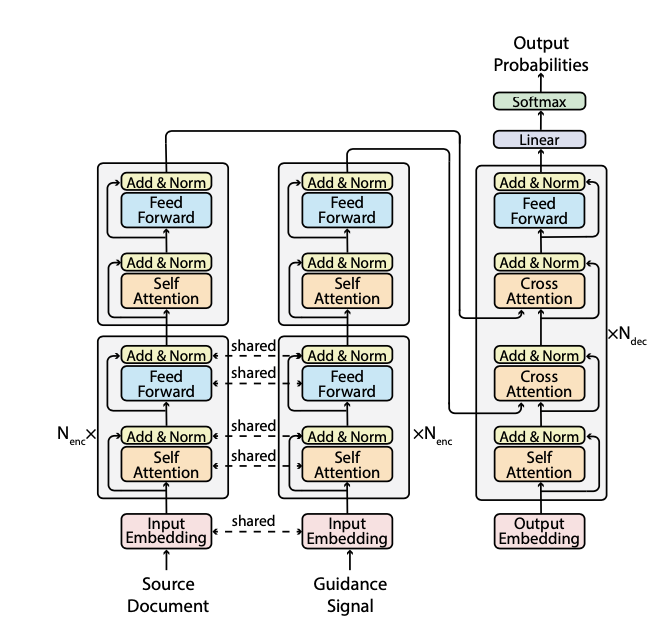

# E-BART

Implementation of the Master Thesis [Leveraging Event Relation Extraction for Abstractive Summarization of Narratives: A Transformer-based Approach](https://drive.google.com/file/d/10BZcmVW58vcf13cZb0YOeEtXjysA3_Wk/view?usp=sharing), by Clément Gillet, 2023.

This repo contains all the code related to my **Master Thesis Research**. The **research question** is the following: 

"In the **narrative domain**, can we **improve performance of transformer-based summarizers**, i.e. quality and controllability of summaries, **by leveraging Event Relations** in the input document?"

## Architecture

#### Main Commands to operate:

- **Launch** = `bash /netscratch/gillet/projects/pegasus-bridle/wrapper.sh python run_summarization.py --model_name_or_path facebook/bart-large --do_train --do_eval --do_predict --train_file /ds/other/GS2/train.json --validation_file /ds/other/GS2/validation.json --test_file /ds/other/GS2/test.json --output_dir /netscratch/gillet/projects/NarraSum_model/output/GS2 --per_device_train_batch_size=8 --per_device_eval_batch_size=8 --overwrite_output_dir --predict_with_generate --learning_rate 0.00003 --text_column document --summary_column summary --run_name NarraSum_Baseline --max_target_length 250 --num_train_epochs 3 --load_best_model_at_end True --evaluation_strategy steps --eval_steps 1000 --save_steps 1000 --metric_for_best_model rouge1 --max_eval_samples 300`

#### 2. Add arguments according to needs:
- **initialPose** = "upwards", "downwards". If None, it starts with a totally arbitrary joint configurations (within the joint limits).

Extra : You can also input a specified configuration vector (as a python list) of 7 angles in radians within the joint limits

- **constrainedDimensions** = [x,y,z,alpha, beta, gamma] . Give a 1 to the dimensions you want to block, a 0 to the ones that should be free of constraint.

- **lr** = Learning Rate of Gradient Ascent. Give it any value above 0.0 .

- **c** = Convergence Rate. The smaller it is, the longer the algorithm is trying to maximize.

- **P** = True or False. To include the Joint Limit Penalty in the Manipulability Measure.

- **k** = Parameter that influences how the joint limits are impacting overall Manipulability Measure. Give it a value above 0. Under 10.000, the search evolves very slow.

#### Values by default:
- `initialPose = None`
- `constrainedDimensions = [0,0,0,0,0,0]`
- `lr = 6.5` 
- `c = 0.0001` 
- `P = False` 
- `k = 2000`
## Output

The algorithm will **output** an **array of length 2**. 

The **1st entry** is all the manipulability values (objective function) reached at each gradient step of the ManGA. 

The **2nd entry** is the final optimal configuration after convergence of the ManGA.
## Installation

1. Ubuntu Version 20.04
2. Install Anaconda for Python3 - https://docs.anaconda.com/anaconda/install/linux/
3. Create a Python3.8 environment with anaconda and activate it - https://docs.conda.io/projects/conda/en/latest/user-guide/tasks/manage-environments.html
4. Install the following python packages: https://git.tu-berlin.de/-/snippets/429
5. Install ROS Noetic (ros-noetic-desktop-full) - http://wiki.ros.org/noetic/Installation/Ubuntu
6. Setup a catkin_ws - http://wiki.ros.org/catkin/Tutorials/create_a_workspace
7. Clone the following repositories into `catkin_ws/src/`:  
    7.1 Franka Panda Description - https://git.tu-berlin.de/rbo/robotics/franka_panda_description  
    7.2 Franka Panda Analytical Inverse Kinematics - https://git.tu-berlin.de/rbo/robotics/franka-panda-analytical-inverse-kinematics  
    7.3 RH3 Description - https://git.tu-berlin.de/rbo/robotics/rh3-description  
    7.4 RH3 Kinematics - https://git.tu-berlin.de/rbo/robotics/rh3-kinematics  
8. Run `catkin build` from `/catkin_ws`.
9. `source catkin_ws/devel/setup.bash`
10. Install PyKDL and Kinematic/Dynamic Utils functions: https://git.tu-berlin.de/-/snippets/430
11. Install Hrl-Kdl: https://git.tu-berlin.de/rbo/robotics/hrl-kdl
12. Add 2 py files of this project (ManGA_Utils.py & ManGA.py) to path ~/catkin_ws/src/rh3-kinematics/notebooks/Manipulability
13. Add ManGA_Notebook.ipynb file of this project to same path
14. Launch all required nodes and services via `roslaunch rbohand3_kinematics start_ik_fk_services_rviz.launch load_panda_arm:=1 panda_ik_service:=1`
15. `cd catkin_ws/src/rbohand3_kinematics/notebooks/Manipulability` and run `jupyter notebook`
16. Open `ManGA_Notebook.ipynb` and get started (see Input/ Output section of this README)

## Python Requirements

Download [requirements.txt](https://drive.google.com/file/d/1LYowcSEg1Nsuoy7ln9x8Vz_yrIB9VRpd/view?usp=sharing) and install all dependencies with following command : 

    pip install -r requirements.txt

