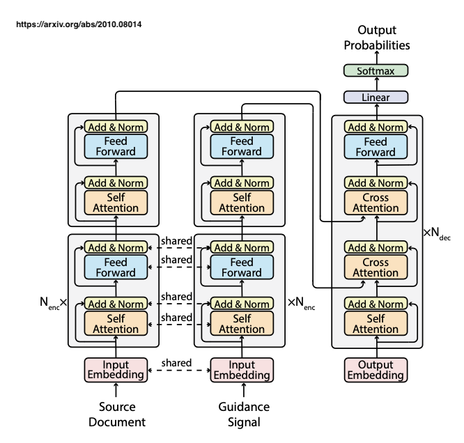

# E-BART

Implementation of the Master Thesis [Leveraging Event Relation Extraction for Abstractive Summarization of Narratives: A Transformer-based Approach](https://drive.google.com/file/d/1siymb7ZUjV2eEBSF51tIDmV0mnFKAQHq/view?usp=sharing), by Clément Gillet, 2023.

This repo contains all the code related to my **Master Thesis Research**. The **research question** is the following: 

"In the **narrative domain**, can we **improve performance of transformer-based summarizers**, i.e. quality and controllability of summaries, **by leveraging Event Relations** in the input document?"

## Architecture


#### Main Commands to operate:

##### Plain BART

```bash
python run_summarization.py \
    --model_name_or_path facebook/bart-large \
    --do_train \
    --do_eval \
    --do_predict \
    --train_file /ds/other/GS6/train.json \
    --validation_file /ds/other/GS6/valid.json \
    --test_file /ds/other/GS6/test.json \
    --output_dir /netscratch/truong/eventsum/E-BART/NarraSum_model/output/baseline \
    --per_device_train_batch_size=8 \
    --per_device_eval_batch_size=8 \
    --overwrite_output_dir \
    --predict_with_generate \
    --learning_rate 0.00003 \
    --text_column document \
    --summary_column summary \
    --run_name NarraSum_Baseline \
    --max_target_length 250 \
    --num_train_epochs 3 \
    --load_best_model_at_end True \
    --evaluation_strategy steps \
    --eval_steps 1000 \
    --save_steps 1000 \
    --metric_for_best_model rouge1 \
    --max_eval_samples 300
```

#### GSum

Original:
```bash
python train.py \
    --train_file /ds/other/NarraSum/NarraSum/train.json 
    --val_file /ds/other/NarraSum/NarraSum/validation.json 
    --test_file /ds/other/NarraSum/NarraSum/test.json 
    --train_guidance /ds/other/GS1_guid/train.json 
    --val_guidance /ds/other/GS1_guid/validation.json 
    --test_guidance /ds/other/GS1_guid/test.json 
    --per_device_train_batch_size 4 
    --output_dir /netscratch/gillet/projects/E-BART/output/GS1 
    --max_eval_samples 300 
    --learning_rate 0.000003 
    --per_device_eval_batch_size 4 
    --max_target_length 250 
    --load_best_model_at_end True 
    --num_train_epochs 3 
    --evaluation_strategy steps 
    --predict_with_generate 
    --metric_for_best_model rouge1
```

```bash 
python e_bart/train.py \
    --train_file /ds/other/GS6/train.json \
    --val_file /ds/other/GS6/valid.json \
    --test_file /ds/other/GS6/test.json \
    --train_guidance /ds/other/GS6_guid/train.json \
    --val_guidance /ds/other/GS6_guid/valid.json \
    --test_guidance /ds/other/GS6_guid/test.json \
    --per_device_train_batch_size 4 \
    --gradient_accumulation_steps 2 \
    --output_dir /netscratch/truong/eventsum/E-BART/NarraSum_model/output/e-bart \
    --max_eval_samples 300 \
    --pretrained_weights /netscratch/truong/eventsum/E-BART/model.bin \
    --learning_rate 0.000003 \
    --per_device_eval_batch_size 4 \
    --max_target_length 250 \
    --run_name NarraSum_E-BART \
    --load_best_model_at_end True \
    --num_train_epochs 3 \
    --evaluation_strategy steps \
    --predict_with_generate \
    --metric_for_best_model rouge1
```

#### Python Requirements

This repository uses Python 3.9.
Download [requirements.txt](requirements.txt) and install all dependencies with following command : 

```bash
pip install -r requirements.txt
```

## Datasets
- [NarraSum](https://github.com/zhaochaocs/narrasum)
- [MAVEN-ERE](https://github.com/THU-KEG/MAVEN-ERE)
- [MAVEN](https://github.com/THU-KEG/MAVEN-dataset)
